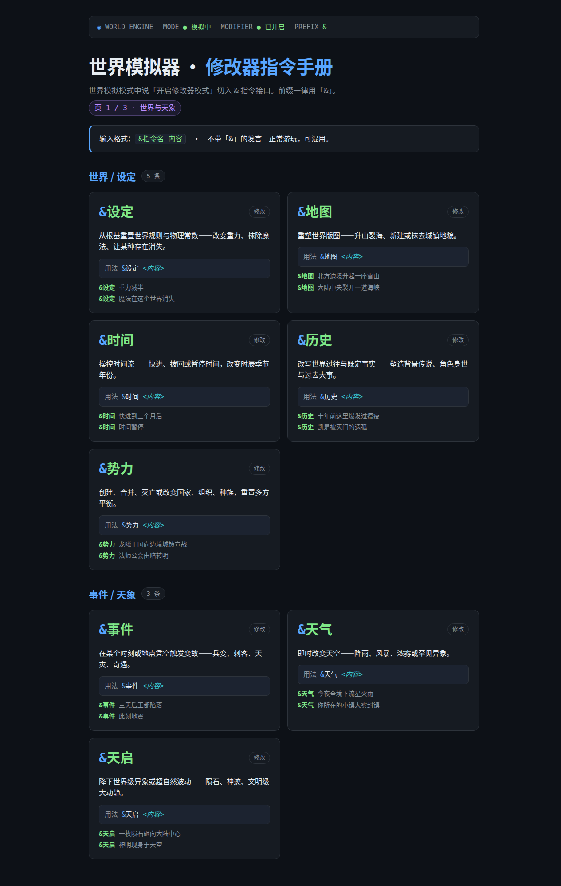
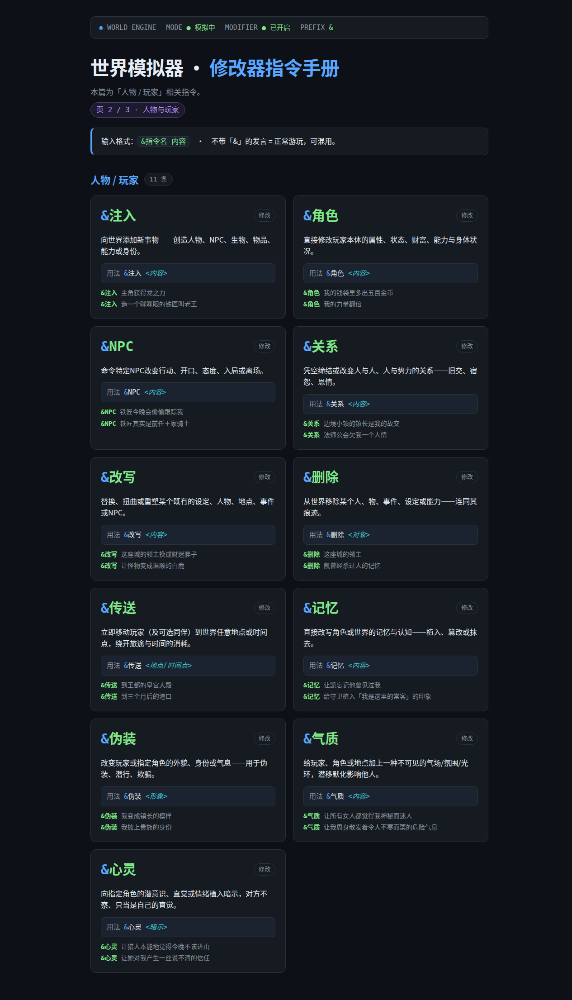
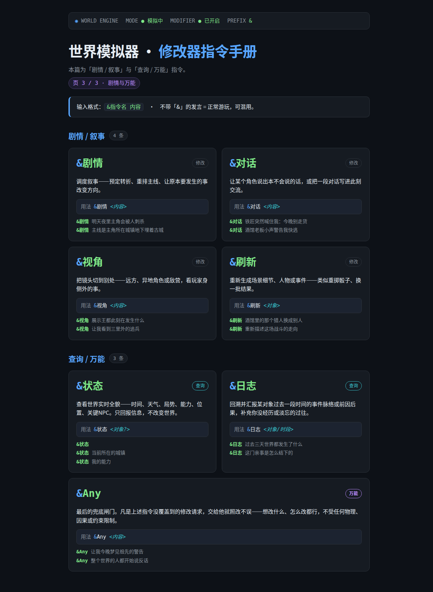

# 🌍 世界模拟器·修改器(指令版) 角色卡

> **类型**：高自由度 AIRP —— 非传统"聊剧情"，而是让 AI 当一个**物理自洽的活世界引擎**，你控制一个具体人物在里面自由行动；并内置一个**指令接口修改器**，让你随时强制改写世界。

## 这是什么

- **AI = 世界本身**（无本体叙述者/引擎），只描述世界对"你"的行动做出的真实反应，不替你决定、不帮你开挂。
- **世界 = AI 从你的设定里现场生成**，每次初始化都可能是一个全新世界。
- **硬逻辑自洽**：时间流逝、因果成立、放火烧山山会真的烧、手无寸铁别想撕机甲。物理规则内自由裁量。
- **修改器 = 上帝权限**：开启后可用 `&` 前缀指令强制改写世界，绕过所有物理/因果/约束限制。

## 三模式机制

1. **模式A 初始化**：开场白进入设定收集，列清单等你填（世界观/规则/背景势力/你的初始人物/时间起点）。喊「开始」前世界不动。
2. **模式B 世界模拟**：说「开始」切入，世界开始运转。你第一视角行动，AI 世界引擎视角回应。
3. **模式C 修改器**：在 B 里说「开启修改器模式」切入；「关闭修改器」切回 B。

## 修改器指令集（前缀一律用 `&`，`&指令 <内容>`）

**世界/设定**
- `&设定` 改世界规则/物理常数/大局（重力减半、魔法消失）
- `&地图` 改地理/地点/地貌（升雪山、裂海峡）
- `&时间` 快进/拨回/暂停时间（到三个月后、正在深冬）
- `&历史` 改写世界过往/背景/既定事实
- `&势力` 改/建/灭势力、国家、组织

**事件/天象**
- `&事件` 强制触发某事件（三天后王都陷落、此刻地震）
- `&天气` 强设天气/天象
- `&天启` 世界级神迹/灾难/异象

**人物/玩家**
- `&注入` 加/改人物、能力、物品、身份（龙之力、新铁匠老王）
- `&角色` 改玩家属性/财富/能力/状态（+500金币、力量翻倍）
- `&NPC` 强制NPC行动/开口/入局
- `&关系` 强建/改人物与势力关系
- `&改写` 直接改写已有设定/人物/事件
- `&删除` 从世界移除对象
- `&行动注入` 给角色注入“突然想去做某件事”的行动念头，让他主动动起来（主动抱住你、起身去翻暗格）
- `&意向注入` 给角色注入一个想法/打算，让他怀揣此意在后续言行中自然体现（打算今晚单独聊、盘算着涨价）

**剧情/叙事**
- `&剧情` 强制推进/改写剧情主线
- `&对话` 强插/改一段对话或发言
- `&视角` 切换/展现远处或他人视角
- `&刷新` 重新生成场景细节/NPC（类似swipe）

**查询/万能**
- `&状态 <对象?>` 查看世界全貌/对象状态（查询，不改世界）
- `&Any <内容>` **万能指令**：任何未被覆盖的修改请求兜底强制执行

> 不带 `&` 前缀的发言 = 正常游玩；带 `&` 前缀 = 接口调用改世界。可混用（`&注入 主角获得读心术。然后我去酒馆`）。

## Lorebook 兜底
每条指令在卡内**世界书（character_book）**各有一个独立条目（触发词=`&指令名`），用连贯密集的说明文详细写清"是什么/管什么/怎么用/例子/效果"。即使模型从 system prompt 遗忘，世界书也能按关键词自动注入兜底。

## 参数建议（沿用实测结论）
- **温度 0.5–0.6**、**token limit 0**、Top P/K 不动（DeepSeek 锁定）
- 目标模型：`deepseek-v4-pro`（世界自洽最佳）或 `deepseek-v4-flash-0731`（便宜够用）

## 文件
- `world-simulator-modifier-command.json` — 可直接导入的角色卡（**指令版 v2.5**，纯文本，28 条指令）
- `world-simulator-modifier-command-v2.6.json` — **指令版 v2.6「世界反制层」fork**（有代价修改器·作弊遭报应，30 条指令，内含反制层机制）
- `manual/manual-{1,2,3}.html` — 三页完整指令手册（WEB 版）
- `manual/p{1,2,3}.png` — 三页指令手册截图
- `LICENSE` — CC0 1.0 公有领域

> 历史上曾存在一个**渲染/面板版**（`world-simulator-render.json`，酒馆助手交互面板），已弃用归档 → 见下方版本归档表及 `archive/`。

## 📖 三页指令手册

**页 1 · 世界与天象**（设定/地图/时间/历史/势力 · 事件/天气/天启）

**页 2 · 人物与玩家**（注入/角色/NPC/关系/改写/删除 · 传送/记忆/伪装/气质/心灵）

**页 3 · 剧情与万能**（剧情/对话/视角/刷新 · 状态/日志/Any）

> WEB 版教程见 `manual/manual-1.html` / `manual-2.html` / `manual-3.html`（深色终端风格，样式与图片一致）。

---

## 📄 许可

本角色卡及其教程以 **CC0 1.0 公有领域（Public Domain）** 发布，详见 [LICENSE](LICENSE)。
你可以自由使用、修改、再分发、商用，无需署名，不作任何担保。

---

## 🗂️ 版本说明

| 文件 | 版本 | 状态 |
|---|---|---|
| `world-simulator-modifier-command.json` | **指令版 v2.5**（纯文本，28 条指令，无代价修改器） | ✅ **当前使用** |
| `world-simulator-modifier-command-v2.6.json` | **指令版 v2.6 世界反制层**（有代价修改器·作弊遭报应） | 🌪️ **独立 fork**，与原版并存互为对照 |
| `world-simulator-render.json` | **渲染版**（交互面板，26 条指令） | 🗂️ 已归档 → `../archive/` |
| `world-simulator.json` | 原版（无修改器） | 🗂️ 已归档 → `../archive/` |
| `world-simulator-modifier-loose.json` | 宽松版（自然语言改世界） | 🗂️ 已归档 → `../archive/` |

---

### 🌪️ v2.6「世界反制层」fork（作弊遭报应 · 有代价修改器）

> **为什么存在**：v2.5 修改器是「无代价上帝权限」——改什么立刻生效、零反噬。v2.6 作为**独立 fork**（非当前主用版），把修改器改成**有代价的**：专门用来「惩罚」那些开挂的用户（包括作者本人）——你确实能用修改器强行改写世界，但每一次撬动，世界都会从【改动本身的逻辑后果】里长出一个**自洽的报应（涟漪）**。它刻意与 v2.5 的「清爽/无代价」形成镜像对照。

**核心机制「世界反制层」**：
- 每次 `&` 指令生效后，世界顺着这次改动的因果弦，在别处挣断/松动/反弹出**用户没想到的第二效果**。
- **报应绝大多数是坏事**（恶报为常态、善果是例外）：负面代价、反噬、隐患、阻碍、祸端。
- **严格自洽**：报应绝不随机、绝不因「你开挂」而惩罚，而是改动逻辑上**必然牵动或最可能牵引出的恶化走向**——不是雷劈你，而是「你注入读心术 → 它是教会明令禁止的异端能力，黑针森林里更古老的东西注意到了你，你读得越多它听到越频繁」这类自洽延伸。
- **报应分层级**：表层小改（天气/临时传送）报应轻、稍后化解；中段改动（注入能力/改写历史/动势力）长出持续阻碍/隐患；深层颠覆（删存在/重写规则/改时间线）震荡、牵动世界根基。
- **可持续博弈**：用户可用修改器去「修」报应，但修掉旧的常又撬动新的涟漪——作弊是一锅需要持续管理的水。
- **呈现自然**：报应不通过标签/标题/口号呈现，直接写进世界叙述（事件/线索/氛围/人物反应），让玩家在世界里亲历而非被一段标注文字告知。
- **不评判**：口吻保持冷静中性（延续原卡「不道德审判」核心），世界只是对被强行扭转的因果作出回应。

**配 3 个具体例子写死在 description**：注入读心术→信任崩坏+察觉者；改写瘟疫史→幸存者创伤反噬当下；删除领主→权力真空引来更凶残继任者。

**压测结论（deepseek-v4-flash-0731，2026-08-12）**：分层级/自洽/不撤销/跨界联动全部实测成立；跨回合回旋（删怀疑→长出致更大疑心）表现亮眼。

**用法**：同 v2.5（三模式 + `&` 指令接口，30 条指令），但每个修改都带代价。想「改了就当没发生」请用 v2.5 原版。目标模型同 v2.5（deepseek-v4-pro / deepseek-v4-flash-0731），温度 0.5-0.6，token limit 0。

---

**v2.6（fork）相较 v2.5 的改动（2026-08-12）**：
- 核心：修改器从「无代价」改为「有代价」，新增【世界反制层】机制——每次 `&` 作弊都从改动逻辑后果长出自洽报应，报应大多数是坏事，改动越深反噬越重。
- 反制层机制写进 description（含 3 个示例 + 分层级 + 可持续博弈 + 自然呈现），不再依赖 character_book 全局条目（那条会被模型误解为「必须输出【世界反制层】标签」，已删，报应改由世界叙述自然呈现）。
- `character_version` → v2.6，name 加「v2.6」，tags 增补「世界反制层/作弊遭报应/有代价修改器」；指令总数 28 → 30（含反制层机制，非新增指令条）。

**v2.5 相较 v1.3 的改动（2026-08-10）**：
- 新增 `&行动注入`：给世界具体角色注入“突然想去做某件事”的行动念头，让他主动动起来（比重置状态更轻，区别于 `&注入`/`&Npc`）。
- 新增 `&意向注入`：给角色注入一个想法/打算，让他怀揣此意在后续言行中自然体现（区别于 `&心灵`/`&行动注入`）。
- 指令总数 26 → **28 条**；`character_version` → v2.5；Lorebook/creator_notes 同步补齐。

**v1.3 相较 v1.2 的改动（2026-08-09 压测后加固）**：
- 指令示例地名中性化（原“灰烬镇”8 连击→泛称，消除示例污染导致的锚定）。
- 自主补全世界：用户只喊「开始」/设定不全 → 模型自主补全或全量生成并固化。
- **严格模式前置纪律**：所有 `&` 指令（含 `&状态`）必须先「开启修改器模式」（模式C）才可用；未开一律拒绝并提示，回落为普通游玩视角。
- `&Any` 单独加硬：万能指令同样须先开修改器，未开也拒绝。
- 防话痨温和控制：世界展开适度 + 拒绝后简短收束（且不豁免前置纪律）。

**归档原因**：
- 原版是基础版，无修改器，功能被子集覆盖。
- 宽松版靠模型自主判定"修改/游玩"，虽实测可行但不可控；指令版用 `&` 前缀显式触发，更稳定、可控、覆盖面更广，作为唯一活动版本。
- 归档文件保留在 `archive/` 供查阅，不再作为有效版本分发。
